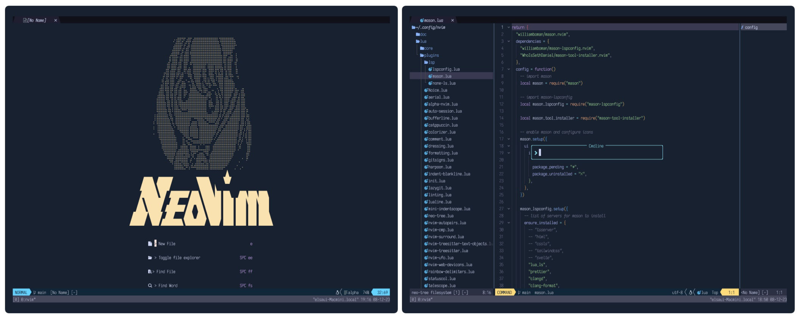
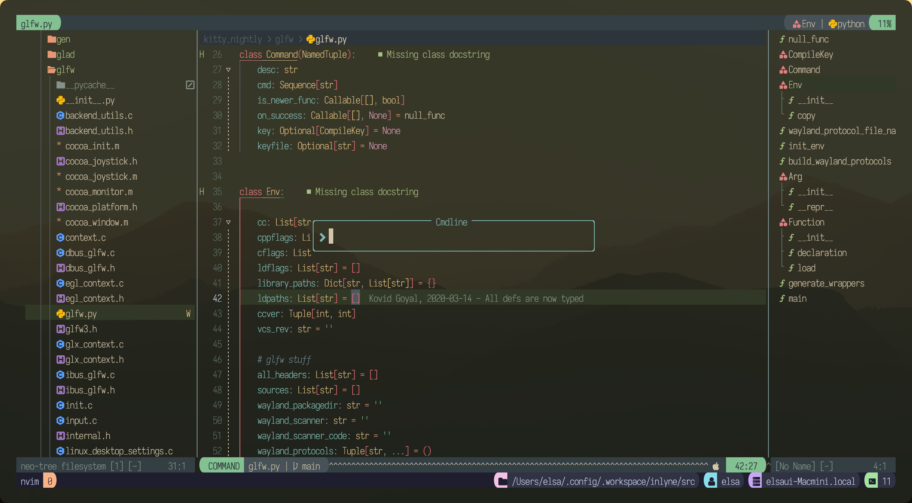
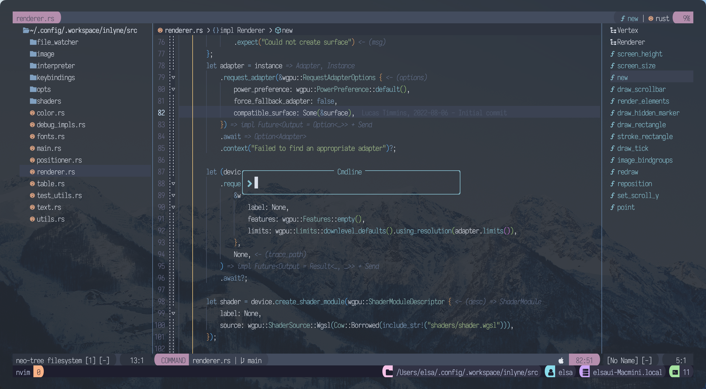
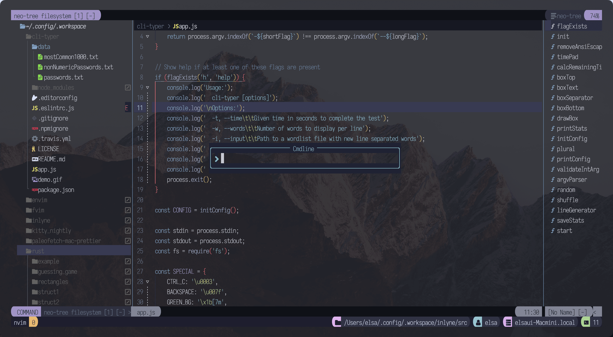
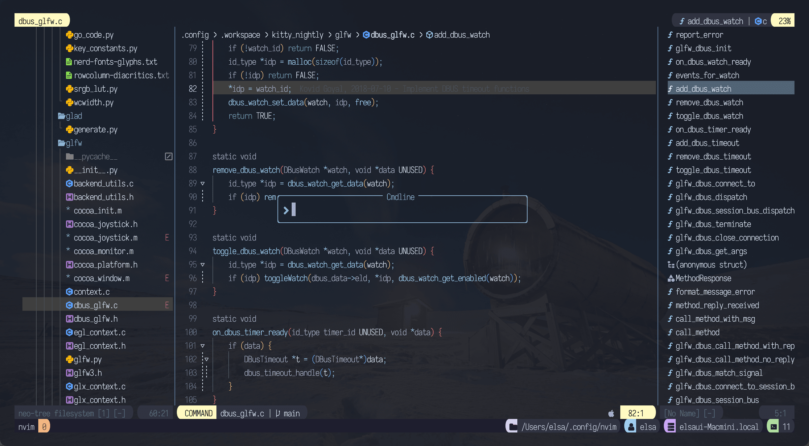
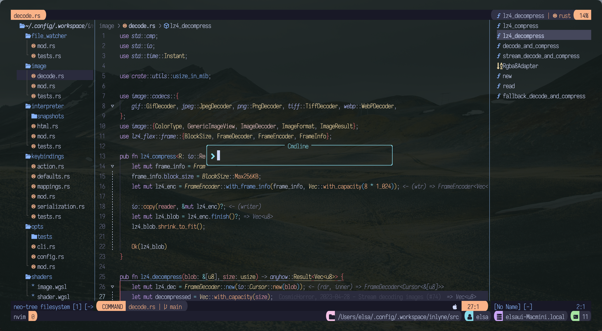
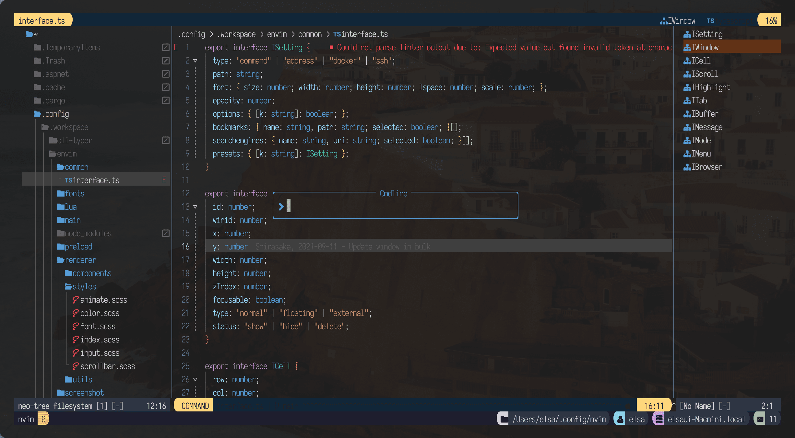

nvim 0.9.4 이상에서 확인
- 심플한 구조,
- plugin 관리를 용이하게 하기 위해 개별 파일로 구성 (Install, config, keymap).
- [cappuccin(Mocha)](https://github.com/catppuccin/nvim) 외 다수의 colors scheme 적용.
- 배경은 모두 투명처리 (배경색은 터미널 배경색)
- Normal 모드에서 ;(semi-colon) 키인으로 Command 모드 변경.
- 저장 시, 자동으로 Trailing whitespace 제거.
- leader 키 : space

------


### Themes

forest


nord


iceberg


poimandres


catppuccin


vscode



------

### Plugins
- 별도의 comment가 없는 것은 기본 키맵을 사용하는 것임.

[stevearc/aerial.nvim](https://github.com/stevearc/aerial.nvim)
```
aerial 키맵
<leader>a : aerial Toggle
```
[ThePrimeagen/harpoon.nvim](https://github.com/ThePrimeagen/harpoon/tree/harpoon2) - Harpoon2 branch
```
harpoon 키맵
<leader>ha : append
<leader>hr : remove
<leader>hc : remove all (clear)
<leader>hn : next
<leader>hp : previous
<leader>hq : quick menu
```
[kdheepak/lazygit.nvim](https://github.com/kdheepak/lazygit.nvim)
```
lazygit 키맵
<leader>lg : LazyGit
```
[mfussenegger/nvim-lint](https://github.com/mfussenegger/nvim-lint)
```
nvim-lint 키맵
<leader>ll : Trigger linting for current file
```

[nvim-neo-tree/neo-tree.nvim](https://github.com/nvim-neo-tree/neo-tree.nvim);
```
neo-tree 키맵
<leader>e  : focus NeoTree
<leader>tt : NeoTree Toggle
```

[koenverburg/poopsight.nvim](https://github.com/koenverburg/peepsight.nvim);
```
peepsight 키맵
<leader>pe : Peepsight Enable
<leader>pd : Peepsight Disable
```
[nvim-neorg/neorg](https://github.com/nvim-neorg/neorg)
```
neorg 키맵
<leader>nn  : Neorg
<leader>njt : Journal Today
<leader>njy : Journal Yesterday
<leader>njn : Journal Tomorrow
```

[3rd/image.nvim](https://github.com/3rd/image.nvim)    -- kitty terminal에서 nvim을 사용할 경우, markdown 문서, neorg 등에서 이미지를 표시.
```
# 필수 설치
brew install imagemagick luarocks lua51

# luarocks을 이용한 magick 설치
luarocks --local --lua-version=5.1 install magick

# 위의 magick 설치까지만 하면 정상적으로 동작해야 함.
# 만일 magick을 설치했음에도, 설치 하지 않았다는 오류가 발생한다면.. 아래의 dylib 설정을 시도 해 본다.
# dylib 설정
# imagemagick 버전에 따라 폴더명과 libMagicWand-****.dylib 파일명은 다를 수 있음
sudo ln -sv /opt/homebrew/Cellar/imagemagick/7.1.1-23/lib/libMagickWand-7.Q16HDRI.dylib /usr/local/lib/libMagickWand-7.Q16HDRI.dylib

# tmux를 사용하는 경우
# .tmux.conf 파일에 아래의 내용을 추가
set -gq allow-passthrough on
# .tmux.conf 파일을 저장한 후, shell 에서 tmux source ~/.tmux.conf 를 실행

```

[utilyre/barbecue.nvim](https://github.com/utilyre/barbecue.nvim)

[FabianWirth/search.nvim](https://github.com/FabianWirth/search.nvim)

[karb94/neoscroll.nvim](https://github.com/karb94/neoscroll.nvim)

[ggandor/leap.nvim](https://github.com/ggandor/leap.nvim)

[kdheepak/tabline.nvim](https://github.com/kdheepak/tabline.nvim)

[neovim/nvim-lspconfig.nvim](https://github.com/neovim/nvim-lspconfig)

[williamboman/mason.nvim](https://github.com/williamboman/mason.nvim)

[nvimtools/none-ls.nvim](https://github.com/nvimtools/none-ls.nvim)

[folke/noice.nvim](https://github.com/folke/noice.nvim)

[folka/lazy.nvim](https://github.com/folke/lazy.nvim)

[folka/todo-comments.nvim](https://github.com/folke/todo-comments.nvim)

[folka/which-key.nvim](https://github.com/folke/which-key.nvim)

[nvim-lualine/lualine.nvim](https://github.com/nvim-lualine/lualine.nvim)

[goolord/alpha.nvim](https://github.com/goolord/alpha-nvim)

[akinsho/bufferline.nvim](https://github.com/akinsho/bufferline.nvim)

[NvChad/nvim-colorizer](https://github.com/NvChad/nvim-colorizer.lua)

[numToStr/Comment.nvim](https://github.com/numToStr/Comment.nvim)

[stevearc/dressing.nvim](https://github.com/stevearc/dressing.nvim)

[lewis6991/gitsigns.nvim](https://github.com/lewis6991/gitsigns.nvim)

[lukas-reineke/indent-blakline.nvim](https://github.com/lukas-reineke/indent-blanklVine.nvim) - rainbow-delimiters integrationV

[HiPhish/rainbow-delimiters.nvim](https://github.com/HiPhish/rainbow-delimiters.nvim)

[nvim-lua/plenary.nvim](https://github.com/nvim-lua/plenary.nvim)

[christoomey/nvim-tmux-navigator](https://github.com/alexghergh/nvim-tmux-navigation)

[windwp/nvim-autopairs](https://github.com/windwp/nvim-autopairs)

[hrsh7th/nvim-cmp](https://github.com/hrsh7th/nvim-cmp)

[hrsh7th/cmp-buffer](https://github.com/hrsh7th/cmp-buffer)

[hrsh7th/cmp-path](https://github.com/hrsh7th/cmp-path)

[L3MON4D3/LuaSnip](https://github.com/L3MON4D3/LuaSnip)

[saadparwaiz1/cmp_luasnip](https://github.com/saadparwaiz1/cmp_luasnip)

[refamadriz/friendly-snippets](https://github.com/rafamadriz/friendly-snippets)

[onsails/lspkind.nvim](https://github.com/onsails/lspkind.nvim)

[kylechui/nvim-surround](https://github.com/kylechui/nvim-surround)

[nvim-treesitter/nvim-treesitter](https://github.com/nvim-treesitter/nvim-treesitter)

[nvim-treesitter/nvim-treesitter-textobjects](https://github.com/nvim-treesitter/nvim-treesitter-textobjects)

[kevinhwang91/nvim-ufo](https://github.com/kevinhwang91/nvim-ufo)

[nvim-tree/nvim-web-devicons](https://github.com/nvim-tree/nvim-web-devicons)

[luukvbaal/statuscol.nvim](https://github.com/luukvbaal/statuscol.nvim)

[nvim-telescope/telescope.nvim](https://github.com/nvim-telescope/telescope.nvim)
