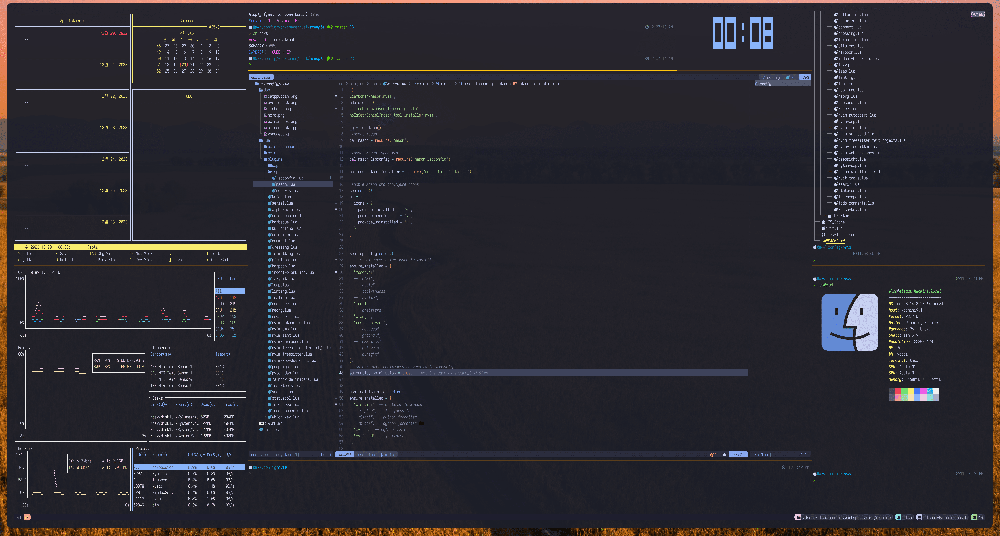

# dotfiles
macOS에 적용 중인 dotfile 저장소



------

<details>
  <summary>tmux 설치/설정</summary>

### 설치
```shell
brew install tmux
```
### tmux true color 설정

~/.tmux.conf에 다음과 같이 설정
```
set -g default-terminal "tmux-256color"
set-option -sa terminal-features ",xterm-256color:RGB"
set-option -ga terminal-overrides ",eterm-256color:Tc"
```

.zshrc 에 다음과 같이 설정
```
alias tmux="tmux -2"
```

~/.config/kitty/kitty.conf에 다음과 같이 설정
```
term        xterm-256color
```

source ~/.zshrc
termnial을 다시 실행하고, nvim에서 :checkhealth를 수행했을 때, 아래와 같은 결과가 나와야 한다.


------

### <span style="color:yellow">kitty terminal 실행 시, tmux 자동 실행</span>

~/.zshrc를 열고, 제일 마지막에 다음을 추가
```
[ -z "$TMUX" ] && command -v tmux &> /dev/null && tmux
```


------

### <span style="color:yellow">tmux에서 nvim 실행 시, insert mode에서 커서가 변경되지 않는 문제.</span>

.tmux.conf에 다음을 추가한다.
```
set-option -ga terminal-overrides '*:Ss=\E[%p1%d q:Se=\E[ q'
```
tmux shell에서 tmux kill-server를 실행 한 후, 다시 tmux를 실행하면 적용됨.


------

### <span style="color:yellow">tmux 사용법 간단 정리.</span>
- command prefix(ctrl-b)키를 누른 후에 다음 키를 누를 때는, command prefix를 누르고 있지 않아도 됨.
- 아래의 테이블에서 ctrl-b(command prefix)는 그냥 Prefix로 표현함
- pane은 tmux window의 분활된 화면(panel)을 의미

| 단축키              | 설명                                                        |
| ------------------- | ----------------------------------------------------------- |
| Prefix  %           | pane를 세로로 추가                                          |
| Prefix  "           | pane을 가로로 추가                                          |
| Prefix  {           | 현재 pane의 위치를 시계 방향으로 변경(swap)                 |
| Prefix  }           | 현재 pane의 위치를 반 시계 방향으로 변경(swap)              |
| Prefix  [space key] | 가로로 분할돤 pane을 세로로 변경 혹은 그 반대 경우로 toggle |
| Prefix  x           | 사용 중인 pane을 종료                                       |
| Prefix ?            | tmux의 단축키 help, 종료는 q                                |
| Prefix  방향키      | 커서를 해당 방향의 panel로 이동 (change focus)              |


------

### <span style="color:yellow">tmux plugin manager TPM 설치 밑 catpppuccin theme 설치</span>

Tmux  Plugin Manager (TPM) 설치

```shell
git clone https://github.com/tmux-plugins/tpm ~/.tmux/plugins/tpm
```

git lone이 완료되면, ~/.tmux.conf를 열고, 파일 제일 하단에 아래의 내용을 추가한다.

```shell
# List of plugins

set -g @plugin 'tmux-plugins/tpm'
set -g @plugin 'tmux-plugins/tmux-sensible'


# Initialize TMUX plugin manager (keep this line at the very bottom of tmux.conf)
run '~/.tmux/plugins/tpm/tpm'
```

파일을 저장하고 shell로 나와서 아래의 명령을 수행

```shell
tmux source-file ~/.tmux.conf
```

다시, ~/.tmux.conf 파일을 열고, catppccin plugin을 설치한다.

```shell
# catppuccin plugin
set -g @plugin 'catppuccin/tmux'
set -g @catppuccin_flavour 'mocha' # or frappe, macchiato, mocha
set -g @catppuccin_window_left_separator "█"
set -g @catppuccin_window_right_separator "█ "
set -g @catppuccin_window_number_position "right"
set -g @catppuccin_window_middle_separator "  █"

set -g @catppuccin_window_default_fill "number"

set -g @catppuccin_window_current_fill "number"
set -g @catppuccin_window_current_text "#{pane_current_path}"

set -g @catppuccin_status_modules_right "application session date_time"
set -g @catppuccin_status_left_separator  ""
set -g @catppuccin_status_right_separator " "
set -g @catppuccin_status_right_separator_inverse "yes"
set -g @catppuccin_status_fill "all"
set -g @catppuccin_status_connect_separator "no"

# --------------------------------------------
set -g @plugin 'tmux-plugins/tpm'
set -g @plugin 'tmux-plugins/tmux-sensible'

```

점선 위의 내용만 추가하면 된다.  추가가 완료 되었으면.. 저장 후, 다시 tmux shell로 나온다.

```shell
Prefix + I
```

ctrl-b + I (대문자 i)를 눌러주면, 아래와 같은 화면이 나오면서  plugin을 설치하게 된다.


</details>
<details>

    <summary>yabai & skhd</summary>

    ```shell
    # change focus within space
    alt - left  : focus west
    alt - right : focus east
    alt - down  : focus south
    alt - up    : focus north

    # move window (warp)
    ctrl + alt - <arrow key>

    # swap windows
    cmd + alt - <arrow key>

    # resize window
    shift + alt - <arrow key>
    ```

 </details>
