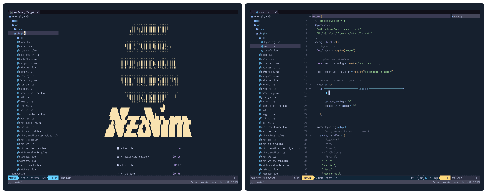

심플한 구조, cappuccin colorscheme 적용, 배경은 모두 투명처리.

적용된 plugin

[neovim/nvim-lspconfig.nvim](https://github.com/neovim/nvim-lspconfig)

[williamboman/mason.nvim](https://github.com/williamboman/mason.nvim)

[nvimtools/none-ls.nvim](https://github.com/nvimtools/none-ls.nvim)

[folke/noice.nvim](https://github.com/folke/noice.nvim)

